## Android API Server (AAS)
[](https://jitpack.io/#nightmare-space/android_api_server)

AAS is a server that provides RESTful APIs for Android devices. It is based on the HTTP protocol and can be accessed by any client that supports HTTP. It is designed to be lightweight and easy to use, supporting hot-plugging, allowing you to load your custom plugins with very short code.

It supports upper-layer frameworks such as Web or Flutter or any other frameworks that cannot directly access Java.

For example, in Flutter, we almost need to use MethodChannel to access Android APIs.

After implementing with MethodChannel, it cannot support accessing Android's MethodChannel in Flutter Web.

AAS provides a ready-to-use [Flutter Plugin](https://github.com/nightmare-space/android_api_server_flutter), or you can implement clients in any language according to [API.md](docs/API.md).

## Features

- RESTful: Get information related to Android APIs via HTTP protocol.
- Plugin support: Custom plugins can be supported with simple code.
- Built-in APIs: Various APIs to get Context and Services in Dex.
- Built-in plugins: Multiple plugins, such as getting the app list, app icons, creating virtual displays, etc.
- Flutter Plugin support: Just include the Flutter dependency, and AAS will start with the plugin registration. You only need to call the Dart API on the Flutter side.
- Multiple modes support: Supports Activity Mode and Dex Mode.
- Security: A simple authentication to prevent malicious calls from port scanning.

## Architecture Diagram

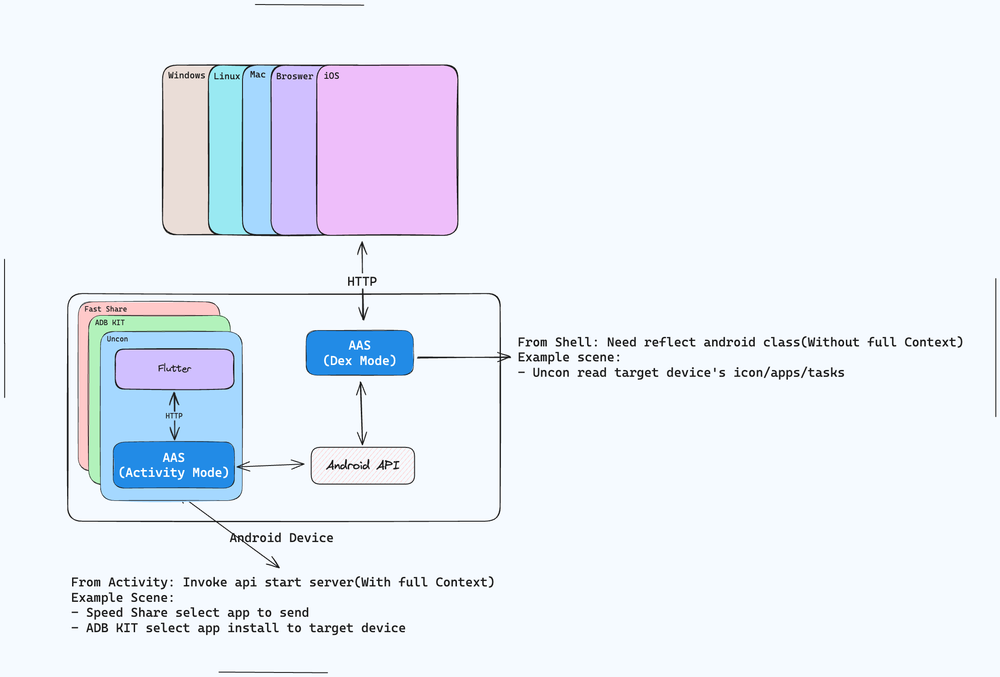

For upper-layer applications, only the Address and Port are perceived, regardless of the running mode.

You can get Android information via HTTP from anywhere, on any device.

Since HTTP is not secure, AAS has built-in simple interface authentication to prevent malicious calls from port scanning.

## Getting Started

AAS has two running modes.

### Activity Mode

In this case, AAS has a real Activity Context. For getting the app list, it needs to request permissions like accessing APIs on Android itself.

But the benefit of Restful API is that you can get an app's icon with such code (Flutter):

```dart
AASClient aasClient = AASClient();
Image.network(aasClient.iconUrl('com.nightmare'))
```

AASClient is multi-instance, and all APIs are encapsulated under AASClient.

Multi-instance allows loading information from different devices on the same page, such as Uncon.

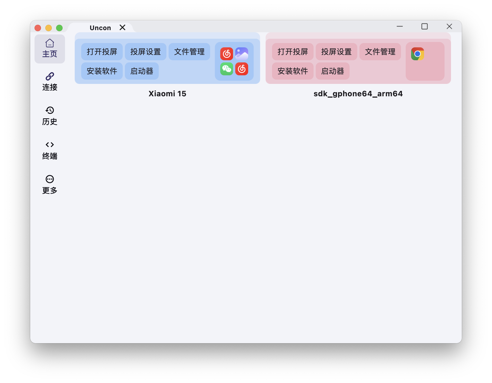

## Dex Mode

The startup script is in [auto.sh](scripts/auto.sh).

In this mode, Java is first compiled into class files, then converted into dex files by dx or d8 tools.

Run app_process via adb to start dex.

The benefit of this mode is that we can use more permissions, such as getting background task thumbnails, creating virtual displays (with Group).

All Java permissions are for shell (uid 2000), so you don't need to request permissions separately for getting the app list, creating virtual displays, etc.

We can start this service on a device connected to a PC, then get the communication port via adb forward (port forwarding is included in auto.sh).

Next, you still only need to get the app's icon like this:

```dart
AASClient aasClient = AASClient(port: port);
Image.network(aasClient.iconUrl('com.nightmare'))
```

You can also implement various APIs yourself to get features far beyond adb command line, such as icons, background app screenshots, which adb commands do not support.

### Using in Flutter

Provide `android_api_server_client` to quickly enable this capability in Flutter App without manually starting the service. `AAS` starts with Flutter Plugin registration, and directly creating `AASClient` will use the port started by Flutter Plugin.

```yaml
dependencies:
  android_api_server_client:
    git: https://github.com/nightmare-space/android_api_server_client
```

Then directly use the encapsulated Dart API:

```dart
AASClient aasClient = AASClient();
AppInfos infos = await aasClient.getAppInfos();
```

If you need to access the same interface on a PC, just change the port via Dex Mode:

```dart
AASClient aasClient = AASClient(port: 15000);
AppInfos infos = await aasClient.getAppInfos();
```

Suppose I currently have a Flutter interface displaying the app list like this:

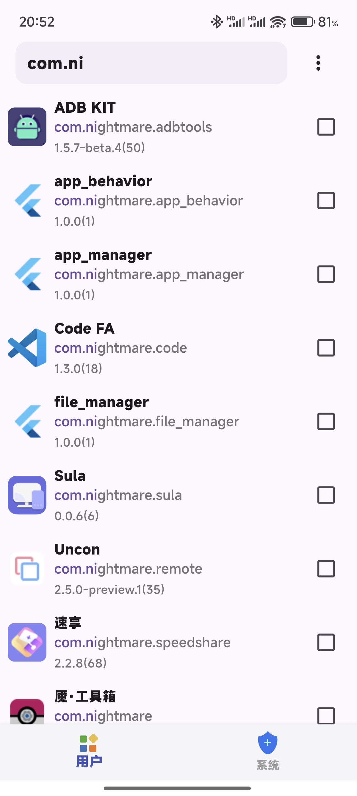

Now I want this interface to be displayed on a PC or in Web.

After starting Dex, I only need to change the port number:

```dart
AASClient aasClient = AASClient(port: Platform.isMacOS ? 15000 : null);
```


In fact, this mode is already widely used in Uncon, Speed Share, and ADB KIT.

The file manager, app list, task list, etc., are all the same code, only the port number is different.

### Using in Native Android

Include the corresponding dependency according to the repository's Tag version:

```gradle
implementation 'com.github.nightmare-space.android_api_server:aas_integrated:v0.1.27'
```

#### Start the service

```java
AASIntegrate aasIntegrate = new AASIntegrate();
try {
    int port = aasIntegrate.startServerFromActivity(context);
    Log.d(TAG, "port -> " + port);
} catch (Exception e) {
    Log.d(TAG, "error -> " + e);
    e.printStackTrace();
}
```

## Example Code

The example code includes all API usage methods. The example code is the best way to understand AAS.

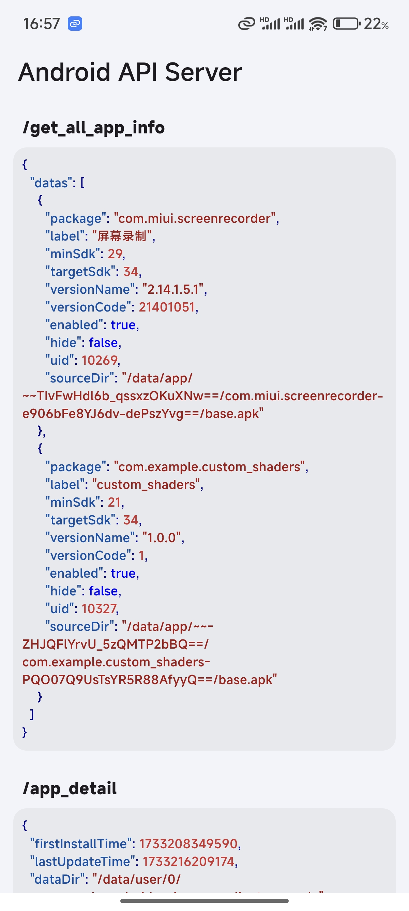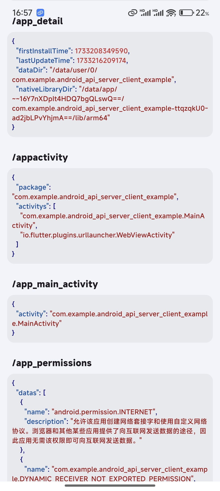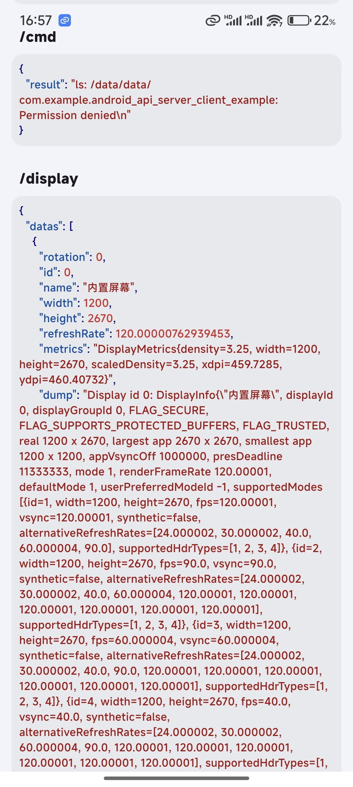
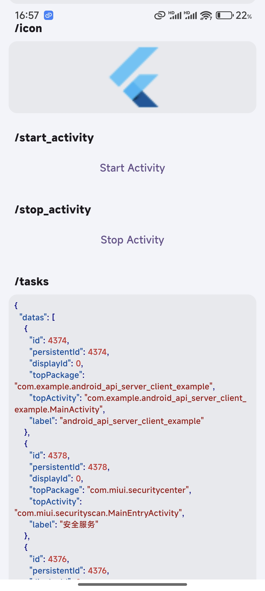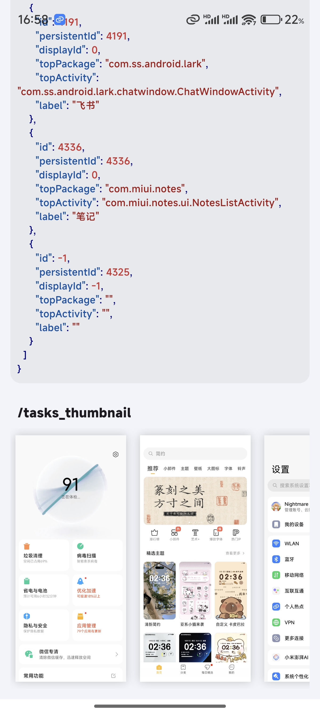

See the complete code in [Flutter Example](https://github.com/nightmare-space/android_api_server_flutter/tree/main/example).

## Repository Introduction

- ass: This is the framework itself, a shell without any plugins. If you need to use this mode, just depend on this.
- aas_hidden_api: An elegant solution to access Android hidden APIs, compileOnly dependency to aas_plugin and aas.
- aas_integrated: A library integrated with aas_plugin. If you need some existing plugins, use this directly.
- aas_plugin: Implements some plugins used in personal projects, such as ActivityManagerPlugin, DisplayManagerPlugin, etc.

## Developing Custom Plugins
TODO

## Outlook
I always think Tencent's PerfDog is too expensive. Using AAS, I think it should be possible to write a new PerfDog to get frame rate android other information on Android.
Also, Scene, LibChecker, can be supported on PC or even Web using AAS.

## Who is using it?
- [Speed Share](https://github.com/nightmare-space/speed_share): `AAS` is integrated into Speed Share in `Activity Mode`, allowing Speed Share to get the app list on the Flutter side to select an app to send to other devices.
- [ADB KIT](https://github.com/nightmare-space/adb_kit): `AAS` exists in both Activity Mode and Dex Mode in ADB KIT. The former is similar to Speed Share, used when we need to install an already installed Apk on the connected device. After a device is successfully connected, ADB KIT starts Dex Mode's AAS via app_process to achieve functions that adb command line cannot directly implement, such as file viewing and preview.
- Uncon (closed source): Exists in both Activity Mode and Dex Mode, similar to ADB KIT. After starting Dex Mode's AAS, Uncon is used to load the tasks running on the target device.

### More Scenario Screenshots

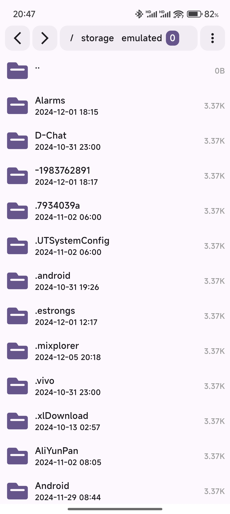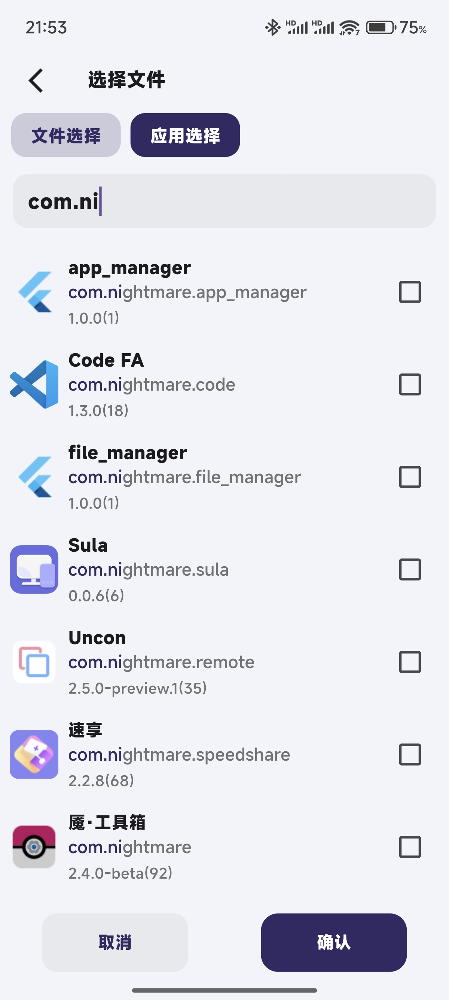

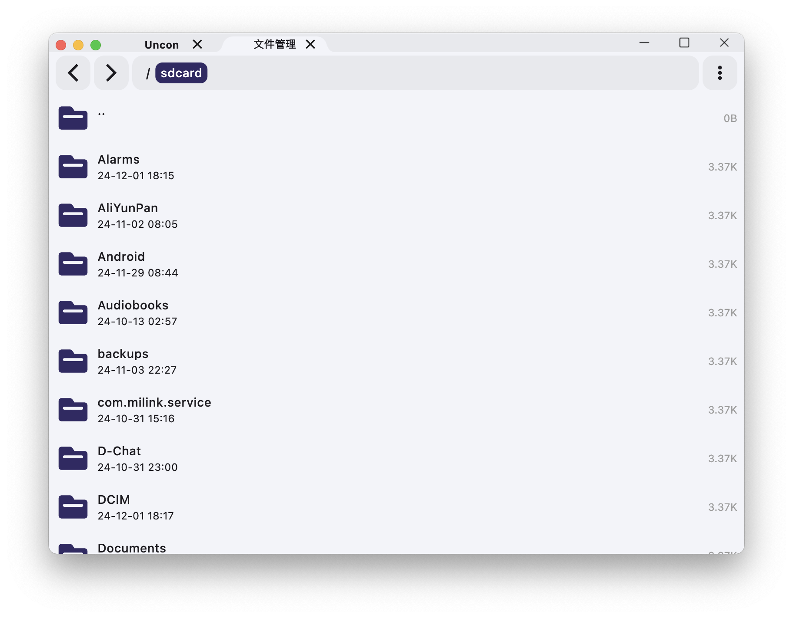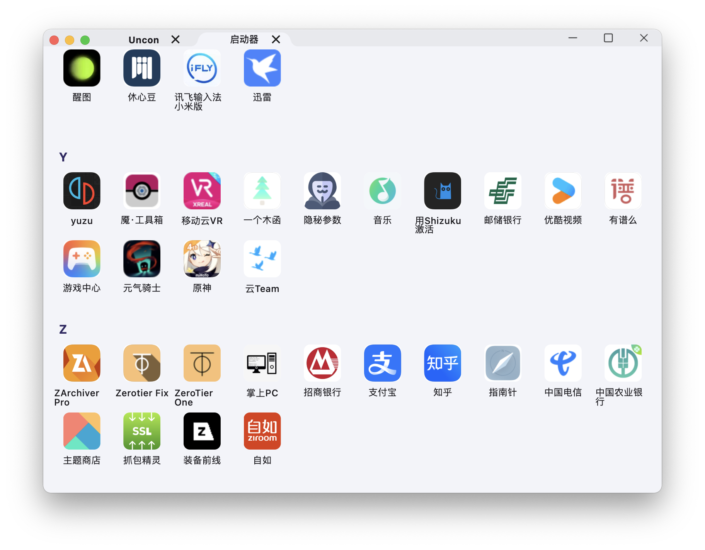